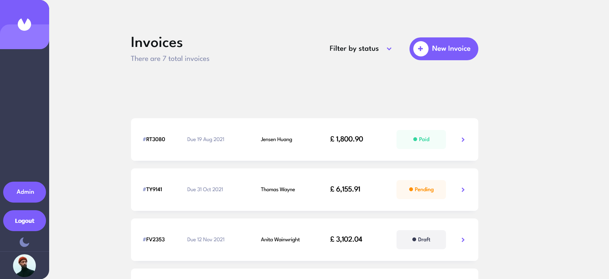

# Fullstack Invoice Project


[](https://github.com/djblackett/invoice-web-app/actions/workflows/frontend-deploy.yaml)




## Table of Contents

- [Fullstack Invoice Project](#fullstack-invoice-project)
  - [Table of Contents](#table-of-contents)
  - [Project Overview](#project-overview)
  - [Links](#links)
  - [Implementation highlights](#implementation-highlights)
  - [Tech Stack](#tech-stack)
    - [Frontend](#frontend)
    - [Backend](#backend)
    - [DevOps](#devops)
  - [Getting Started](#getting-started)
    - [Prerequisites](#prerequisites)
    - [Installation](#installation)
    - [Running the Application](#running-the-application)
  - [Testing](#testing)
  - [Deployment](#deployment)
  - [Diagrams](#diagrams)
  - [License](#license)
  - [Contact](#contact)

## Project Overview

The Fullstack Invoice Project is a robust invoicing application designed as a complete full-stack solution to streamline invoice management. It implements all CRUD operations along with user authentication and management.  

Originally initiated as a **[FrontendMentor](https://www.frontendmentor.io/challenges/invoice-app-i7KaLTQjl)** challenge in May 2022 to enhance CSS skills, the project has evolved into a comprehensive application featuring both a dynamic frontend and a scalable backend. The backend leverages and expands on principles from the **[FullStackOpen](https://fullstackopen.com)** course, ensuring maintainability and a solid foundation for testing.

More details on my motivation and approach to writing this app can be found in the [project description](./project-description.md). You can also view the specific requirements of the [Frontend Mentor challenge](./README-frontend-mentor.md).

## Links

- [Live demo](https://djblackett.github.io/invoice-web-app/)
- [Github repository](https://github.com/djblackett/invoice-web-app)

## Implementation highlights

- **Responsive Frontend** using ReactJS and Styled Components
- **State Management** with Redux Toolkit and React Context
- **GraphQL Integration** via Apollo Client
- **Backend Services** built with NodeJS, ExpressJS, and InversifyJS
- **Database Management** using Prisma ORM and PostgreSQL
- **Unit Testing** for frontend and backend
- **Integration Testing** using Supertest
- **End-to-End (E2E) Testing** using Playwright
- **CI/CD Pipelines** built with GitHub Actions
- **Optimized Docker Containers** utilizing multi step builds
- **Local Container Orchestration** via Docker Compose

## Tech Stack

### Frontend

- **ReactJS** (TypeScript)
- **Styled Components**
- **Redux Toolkit**
- **Apollo Client** (GraphQL)
- **React Testing Library**

### Backend

- **NodeJS** (TypeScript)
- **ExpressJS**, **InversifyJS**
- **Prisma ORM**
- **PostgreSQL**
- **Vitest**

### DevOps

- **Docker Containers**
- **Docker Compose**
- **GitHub Actions** CI/CD Pipeline

## Getting Started

### Prerequisites

Ensure you have the following installed on your machine:

- [Node.js](https://nodejs.org/) (LTS recommended)
- [Docker](https://www.docker.com/get-started)
- [Docker Compose](https://docs.docker.com/compose/install/)
- [Git](https://git-scm.com/)

### Installation

#### Demo and Development Mode Instructions

1. **Clone the repository:**

   ```bash
   git clone https://github.com/djblackett/invoice-web-app.git
   cd invoice-web-app
   ```

2. **Install dependencies for the frontend:**

   ```bash
   cd invoice-frontend
   yarn install
   ```

3. **Install dependencies for the backend:**

   ```bash
   cd invoice-backend  # from project root
   yarn install
   ```

#### Demo Instructions

1. **Run demo docker compose file**

   ```bash
   docker compose -f docker-compose.demo.yml up
   ```

2. **Seed demo data**

   ```bash
   npx prisma db seed
   ```

3. **Access the application**  
 Open your browser and navigate to <https://localhost:5173/invoice-web-app/>.

#### Development Instructions

1. **Set up environment variables:**

   Fill in the `.env` files in both `invoice-frontend` and `invoice-backend` directories with Auth0 and testing credentials. All required variables are listed in the `.env` files.

2. **Set up HTTPS certificates:**  
  mkcert can generate https certificates. MacOS and Linux can install mkcert with [Homebrew](https://formulae.brew.sh/formula/mkcert). Windows users can install it with [chocolatey](https://community.chocolatey.org/packages/mkcert) or with Homebrew if using WSL.

After installation, run:

   ```bash
   mkcert -install
   ```

   Create certs with mkcert

   ```bash
   cd invoice-backend  
   mkdir certs  
   cd certs
   mkcert localhost
   ```

   Copy certs to frontend directory

   ```bash
   cp -r invoice-backend/certs invoice-frontend/certs
   ```

### Running the Application

1. **Start the application using Docker Compose:**  
   Shut down demo mode if currently running: `docker compose -f docker-compose.demo.yml down`, then run:

   ```bash
   docker compose -f docker-compose.dev.yml up
   ```

2. **Access the application:**

   Open your browser and navigate to <https://localhost:5173/invoice-web-app/>.

## Testing

The project includes various levels of testing to ensure reliability and maintainability.

- **Backend Unit Tests:** Implemented using Vitest.
- **Frontend Unit Tests:** Implemented using React Testing Library.
- **Integration Tests:** Verify interactions between backend GraphQL resolvers and a real PostgreSQL database.
- **End-to-End (E2E) Tests:** Implemented with PlayWright and tests normal user flows

To run backend tests:

```bash
cd invoice-backend
yarn test:unit
yarn test:integration
```

To run frontend tests:

```bash
cd invoice-frontend
yarn test:unit
```

E2e tests:  
First, run `docker compose -f docker-compose.dev.yml up` to start all microservices

To run E2E tests separately from the dev environment, update `docker-compose.dev.yml` by commenting out the backend start command on line 34 and uncommenting the one on line 36.

Then:

```bash
cd invoice-frontend
yarn test:e2e
```

## Deployment

The project is configured for deployment using Fly.io and GitHub Pages. Continuous Integration and Continuous Deployment (CI/CD) pipelines are set up with GitHub Actions to automate the build, test, and deployment processes. Upon successful completion of tests, the frontend is built and published to GitHub Pages and the backend to Fly.io.

For both the frontend and backend, when changes are made to the dev branch via push or merge request, a CI pipeline runs and checks the code with a workflow that runs the frontend unit tests and the backend unit and integration tests. The backend integration tests are tested against an ephemeral PostgreSQL database spun up on the GitHub action workspace.

If tests pass, the code is merged into dev and docker containers are built and pushed to Docker Hub. These docker images are not currently used, however, because they are intended for use in Kubernetes deployments, which have not been built yet.

Pull requests to main run the same tests plus end-to-end tests. The frontend is built and run in Vite preview mode for e2e tests, while the backend and an ephemeral PostgreSQL database are also started to test the entire stack.

## Diagrams

### Architecture Flowchart

This diagram provides a high-level overview of the application's flow. The user interacts with the React (TypeScript) frontend, which communicates with the Node.js/Express backend via a GraphQL API (Apollo Client). The backend uses Prisma ORM to manage data in a PostgreSQL database. A CI/CD pipeline with GitHub Actions automates testing and deployment, deploying the frontend to GitHub Pages and the backend to Fly.io.


### IoC Backend Architecture

This diagram shows how InversifyJS manages dependency injection in our backend. Controllers/Resolvers handle requests, delegate logic to Services, and interact with Repositories for data operations. The IoC container ensures modularity, testability, and maintainability.


### GraphQL Schema

GraphQL schema diagrams for [queries, mutations, and subscriptions](./diagrams/graphql-schema.md)

## Future Trajectory

While the Fullstack Invoice Project is functional and meets its core requirements, there are several areas identified for future improvement:

- **Enhanced Test Coverage:**  
  Additional unit, integration, and end-to-end tests will be implemented to further improve the app’s reliability and ease of maintenance.

- **Kubernetes Deployment:**  
  Exploring a Kubernetes-based deployment is on the roadmap. Container orchestration would streamline scaling and provide a more robust production environment.

- **Performance Optimization & Monitoring:**  
  Future work may include performance tuning and implementing enhanced monitoring to better track and optimize application behavior in production.

These enhancements are part of our long-term vision to continuously refine the project, ensuring it remains robust, scalable, and easy to maintain.

## License

This project is licensed under the MIT License. This means you are free to use, modify, and distribute the software, provided that you include the original copyright and license notice in any copies or substantial portions of the software.

## Contact

- **Author:** David Andrea
- **GitHub:** [djblackett](https://github.com/djblackett)
